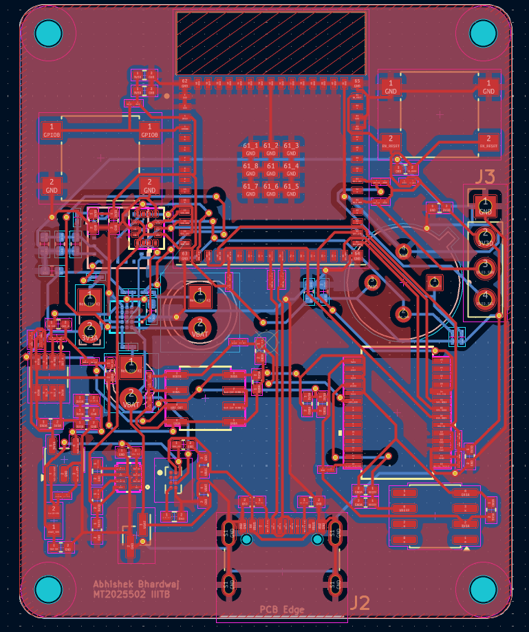

# Non-Invasive Glucose Estimation (NIGE) Platform

## 📌 Project Overview
Monitoring blood glucose levels non-invasively is a significant challenge in biomedical engineering. This platform implements a **Near-Infrared (NIR) Spectroscopy** approach to provide a continuous, painless alternative to traditional finger-prick monitoring.

Unlike standard PPG sensors, this device utilizes specific wavelengths—**950nm and 1050nm**—to target glucose-specific absorption peaks. The hardware is meticulously designed to isolate sub-millivolt changes in reflected light intensity, correlating them with glucose concentration in the interstitial fluid.

## 🛠 Hardware Architecture & Block Functionality

### **1. Optical Frontend (The Core Sensor)**
* **Dual-Wavelength Emitters:** Utilizes a **950nm reference LED** and a **1050nm glucose-sensitive LED**. By comparing the absorption ratios of these two, the system can cancel out artifacts like skin thickness and hydration.
* **MAX86141 (U5):** A medical-grade optical data acquisition system that drives the LEDs with high-precision current control. This ensures stable light output and minimizes noise.
* **AS72652 (U4):** An 18-channel spectral sensor providing a broad "background" analysis of the skin to compensate for environmental interference.

### **2. Precision Analog Signal Chain**
Since the signal of interest is extremely minute, the system uses a 6-stage conditioning pipeline:
* **Transimpedance Stage (OPA2376):** Converts ultra-low photodiode current into a measurable voltage with minimal noise.
* **Active Filtering:** Removes DC ambient light offsets and high-frequency electronic noise.
* **24-bit Digitization (ADS1256):** A high-resolution Delta-Sigma ADC that allows the system to resolve micro-volt level signal fluctuations.
* **Voltage Reference (ADR4525):** Provides an ultra-stable 2.5V reference to prevent measurement drift.

### **3. Sensor Fusion & Calibration**
* **LSM6DSO (IMU):** Tracks motion to filter out "motion artifacts" that occur when the sensor shifts on the skin.
* **MLX90614 (IR Temp):** Monitors skin temperature to calibrate the estimation algorithm, as glucose absorption is temperature-dependent.

### **4. Power Management & Isolation**
To maintain a high Signal-to-Noise Ratio (SNR), the system separates digital and analog power:
* **3V3D (Digital):** Driven by a **TPS62840** Buck converter for the MCU.
* **3V3A (Analog):** Isolated via an **LP2985 LDO** and **Ferrite Bead** to prevent MCU switching noise from corrupting sensitive sensor data.

## 🖼️ Hardware Visuals

### **System Architecture**

### **PCB Layout**

### **3D Renderings**
| Top View | Bottom View |
| :--- | :--- |
|  |  |

## 📂 Project Specifications
| Category | Component | Key Feature |
| :--- | :--- | :--- |
| **MCU** | ESP32-S3-MINI-1 | Dual-core, Wi-Fi/BLE, Hardware Acceleration |
| **ADC** | ADS1256 | 24-bit Resolution, Low Noise |
| **Charging** | BQ25180 | LiPo Management with NTC monitoring |
| **Optics** | 950nm / 1050nm | Differential Spectroscopy Emitters |

## 🚀 Future Roadmap
- [ ] Integration of TinyML models for on-device glucose regression.
- [ ] Miniaturization of the PCB for wearable wrist-band testing.
- [ ] Development of a mobile app for real-time data visualization via Bluetooth.

---
*Developed as part of a graduate-level VLSI/ASIC project focusing on biomedical instrumentation.*
